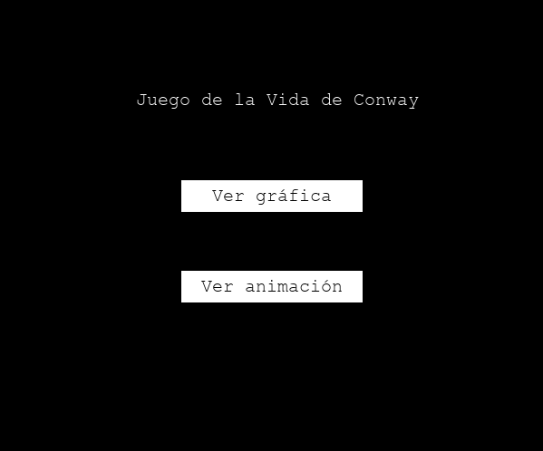
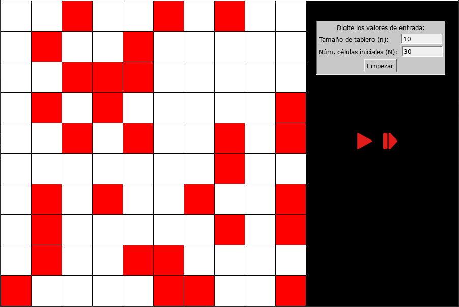
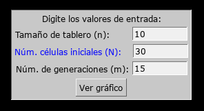
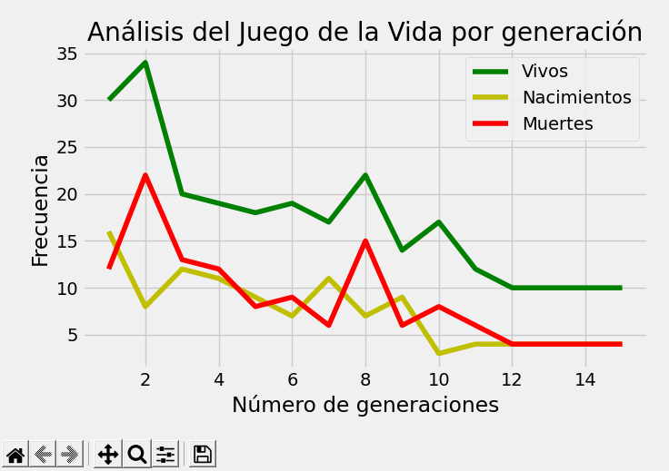

# Conway's Game Of Life - Juego de la Vida de Conway
Python program that simulates the Conway's Game of Life. This simulation is developed 
in Python using PyGame and ThorPy modules for the view and MatplotLib to generate plots. 

# The rules of this game are:
* Any live cell with two or three live neighbors survives.
* Any dead cell with three live neighbors becomes a live cell.
* All other live cells die in the next generation. Similarly, all other dead cells stay dead.

# How it works?
A board of size n × n is created and from N starting cells, located randomly,
 the game will start. From this, and with an input parameter m, 
 where m is the number of generations to display this simulation will 
 show a graph showing the number of live, births and deaths in each generation.
 
### See animation:
> Initial state:

> Final state:

### See plot:
> Set up the params of simulation:

> Watch the statistics:

